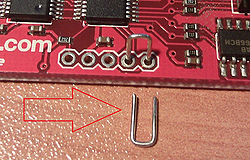

# BUS PIRATE

A note about versioning: exist three different versions:

 - the hardware
 - the firmware
 - the bootloader

[Home](http://dangerousprototypes.com/docs/Bus_Pirate) | [Code](https://github.com/DangerousPrototypes/Bus_Pirate)

In order to use bus pirate you have to connect to it with a serial terminal; I will use the terminal
included with the PySerial (``# pip install pyserial``)

    $ python -m serial.tools.miniterm /dev/ttyUSB0 --baud=115200 --lf

(if you want is possible to use screen: ``screen /dev/ttyUSB0 115200 8N1``).

Follow the [cable pinout](http://dangerousprototypes.com/docs/Common_Bus_Pirate_cable_pinouts)

In order to connect to the an UART port

```
$ python -m serial.tools.miniterm /dev/ttyUSB0 --baud=115200 --lf
--- Miniterm on /dev/ttyUSB0: 115200,8,N,1 ---
--- Quit: Ctrl+]  |  Menu: Ctrl+T | Help: Ctrl+T followed by Ctrl+H ---
    Hiz>i
    Bus Pirate v3a
    Firmware v5.10 (r559)  Bootloader v4.4
    DEVID:0x0447 REVID:0x3046 (24FJ64GA002 B8)
    http://dangerousprototypes.com
    CFG1:0xFFDF CFG2:0xFF7F
    *----------*
    Pinstates:
    1.(BR)	2.(RD)	3.(OR)	4.(YW)	5.(GN)	6.(BL)	7.(PU)	8.(GR)	9.(WT)	0.(Blk)
    GND	        3.3V	5.0V	ADC	VPU	AUX	-	TxD	-	RxD
    P	        P	P	I	I	I	I	I	I	I	
    GND	        0.00V	0.00V	0.00V	0.00V	L	L	H	L	L	
    Power supplies OFF, Pull-up resistors OFF, Normal outputs (H=3.3v, L=GND)
    MSB set: MOST sig bit first, Number of bits read/write: 8
    a/A/@ controls AUX pin
    UART (spd brg dbp sb rxp hiz)=( 8 34 0 0 0 0 )
    *----------*
```

## Pinouts

Exist different versions of cable colors, in this text we use the [seeedstudio](http://www.seeedstudio.com/depot/Bus-Pirate-Cable-p-932.html) one


### Mode

There is a tricky behaviour with pullup resistor and **open collector mode** and **normal pin mode**,
read more [here](https://hackaday.com/2009/07/01/mixed-voltage-interfacing-with-the-bus-pirate/).

## Bootloader

The BP has a bootloader, in hardware v3 can be accessed with the ``pirate-loader`` console
program that you can found in this [repo](https://code.google.com/p/the-bus-pirate/source/checkout)**moved to github**.

To activate the bootloader you have to connect the pins ``PGC`` ``PGD`` like the
image below:



Otherwise is possible to activate it from the console itself

```
HiZ>$
BOOTLOADER
```

**Remember to turn off your terminal to free the serial port before proceeding.** If the
process fail for some reason, you can always reactivate it with the jumpers.

```
$ sudo ./pirate-loader_lnx --dev=/dev/ttyUSB0 --hello
+++++++++++++++++++++++++++++++++++++++++++
  Pirate-Loader for BP with Bootloader v4+  
  Loader version: 1.0.2  OS: Linux
+++++++++++++++++++++++++++++++++++++++++++

Opening serial device /dev/ttyUSB0...OK
Configuring serial port settings...OK
Sending Hello to the Bootloader...OK

Device ID: PIC24FJ64GA002 [d4]
Bootloader version: 1,02
```

## Logic Analyzer
 
 - http://www.hobbytronics.co.uk/bus-pirate-logic-sniffer
 - http://codeandlife.com/2012/05/05/logic-analysis-with-bus-pirate/
 - https://github.com/syntelos/jlac
 - http://www.lxtreme.nl/ols/

| channel | input | color |
|---------|-------|-------|
| 0 | CS | red|
| 1 | MISO | brown |
| 2 | CLK  | yellow |
| 3     | MOSI | orange |
| 4     | AUX  | green |
|  |GND  | black |

## Oscilloscope

 - https://github.com/tgvaughan/PirateScope

## I2C

### Example with the ADXL345

Following the [datasheet](http://www.analog.com/media/en/technical-documentation/data-sheets/ADXL345.pdf),
this device has a frequency of 400KHz.

We will try to read the device id that is at address ``0x00``, should return a value of ``0xE5``

```
I2C>W
POWER SUPPLIES ON
I2C>(1)
Searching I2C address space. Found devices at:
0xA6(0x53 W) 0xA7(0x53 R)
I2C>[ 0xA6 0x00 [ 0xa7 r ]
I2C START BIT
WRITE: 0xA6 NACK
WRITE: 0x00 NACK
I2C START BIT
WRITE: 0xA7 ACK
READ: 0xE5
NACK
I2C STOP BIT
```

Register 0x2D—POWER_CTL (Read/Write) its reset value is ``0x00``, the
important bit is the **measure** one that reflects the measurement state of the
sensor. It's the third bit.

```
I2C>[ 0xa6 0x2d [ 0xa7 r ]
I2C START BIT
WRITE: 0xA6 ACK
WRITE: 0x2D ACK
I2C START BIT
WRITE: 0xA7 ACK
READ: 0x00
NACK
I2C STOP BIT
```

so, uin order to read something we set to 1 the measure bit

```
I2C>[ 0xa6 0x2d 0b00001000]
I2C START BIT
WRITE: 0xA6 ACK 
WRITE: 0x2D ACK 
WRITE: 0x08 ACK 
I2C STOP BIT
```

But the most interesting part is the reading of the actual accelerometer values:
from register ``0x32`` to ``0x37``: we put the accelerometer with the z-axes
pointing upward

```
I2C>[ 0xa6 0x32 [ 0xa7 r:6]
I2C START BIT
WRITE: 0xA6 ACK 
WRITE: 0x32 ACK 
I2C START BIT
WRITE: 0xA7 ACK 
READ: 0x08  ACK 0x00  ACK 0x03  ACK 0x00  ACK 0x00  ACK 0x01 
NACK
I2C STOP BIT
```

 - http://www.starlino.com/bus_pirate_i2c_tutorial.html

## JTAG

In order to use bus pirate with openocd you need to enable it

```
git clone git://git.code.sf.net/p/openocd/code
cd code
./bootstrap
./configure --enable-maintainer-mode --disable-werror --enable-buspirate
make
sudo make install
```

Some informations can be found [here](http://dangerousprototypes.com/docs/Gonemad's_Bus_Pirate/OpenOCD_walk_through).

The cable connection are documented [here](http://dangerousprototypes.com/docs/Bus_Pirate_JTAG_connections_for_OpenOCD)

| BP | JTAG | color |
|---------|-------|-------|
| VPU  | VTRef(3v3) | blue |
| GND  | GND | black |
| MOSI | TDI | violet |
| MISO | TDO | grey |
| CLK  | TCK | yellow |
| CS   | TMS  | red |
| N/A  | TRST | |
| N/A  | RTCK | |
| AUX  | SRST | green |

#### Links

 - http://cybermashup.com/2014/05/01/jtag-debugging-made-easy-with-bus-pirate-and-openocd/
 - Recovering DGN3500 with the Bus Pirate [Post](http://www.earth.li/~noodles/blog/2015/07/recovering-dgn3500.html) pretty recent
 - http://bgamari.github.io/posts/2012-03-28-jtag-over-buspirate.html

## AVR Programming

Can be used with avrdude as is with the following command

```
$ avrdude -c buspirate -p atmega32u4 -P /dev/ttyUSB0 -b 115200
```

or is possible to use an alternative firmware in order to emulate the ``STK500``

```
$ avrdude -c stk500v2 -P /dev/ttyUSB0 -b 115200
```

 - [AVR programming](http://dangerousprototypes.com/docs/Bus_Pirate_AVR_Programming)

## PIC 24FJ64GA002 development board

 - [Original documentation](http://dangerousprototypes.com/docs/Bus_Pirate_v3_PIC_24FJ_blinking_LED_programming_tutorial)
 - [mplabx](http://www.microchip.com/pagehandler/en-us/family/mplabx/)

## Links

 - http://dangerousprototypes.com/docs/Practical_guide_to_Bus_Pirate_pull-up_resistors
 - http://nada-labs.net/2010/using-the-buspirate-with-a-sd-card/
 - Reading from SDHC card using the Bus Pirate [post](https://hackaday.io/project/3686/instructions) by hackaday
 - http://wiki.yobi.be/wiki/Bus_Pirate
 - https://code.google.com/p/the-bus-pirate/wiki/BusPirate102
 - AVR Bus-Pirate-a-like [github](https://github.com/tobyjaffey/bus-ninja)
 
