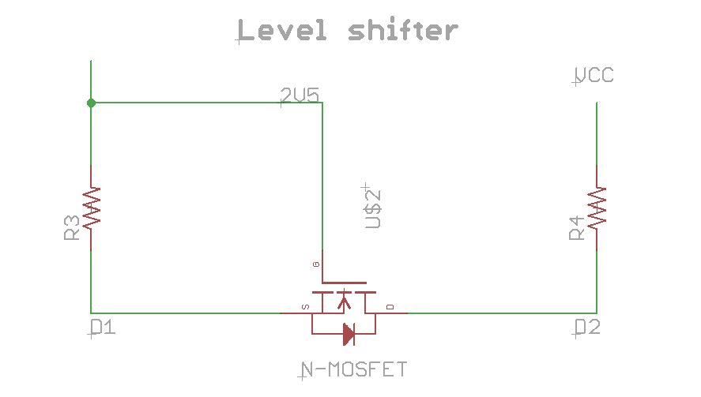

# Cookbook

Some recipes of common used circuits.

## Add voltage

 - [Answer](http://electronics.stackexchange.com/questions/103435/naively-mixing-two-or-perhaps-more-audio-signals) to *Naively mixing two (or perhaps more) audio signals*.

## Reverse polarity

Normally you would use a diode to protect your circuit from reverse polarity
but has some problems

 - voltage drop
 - power consumption

A more efficient way is to use P-FETs [(source here)](https://www.youtube.com/watch?v=IrB-FPcv1Dc) but also it has
some voltage drop and has a larger footprint.

See also this [link from instructables](http://www.instructables.com/id/Reverse-polarity-protection-for-your-circuit-with/).

## Inductive spike

A flyback diode can be used to limit damage when an inductive load uses a
varying current [(source)](https://www.youtube.com/watch?v=LXGtE3X2k7Y).

## PWM to analog

It's possible to use a simple RC filter to transform a digital signal (modulated
with pulse modulation) into a analog signal.

This is done taking into account the spectrum of the square wave
(with a 1Mhz PWM the harmonics occur at 1MHz, 2MHz, 3MHz and so on).

([source](http://www.ti.com/lit/an/spraa88a/spraa88a.pdf))

http://www.allegromicro.com/en/Design-Center/Technical-Documents/Hall-Effect-Sensor-IC-Publications/Method-for-Converting-a-PWM-Output-to-an-Analog-Output-When-Using-Hall-Effect-Sensor-ICs.aspx

```c
/*
 Generating a tone using DDS
*/

unsigned int Acc;
unsigned int Note = 857; // Middle C

void setup() {
  // Enable 64 MHz PLL and use as source for Timer1
  PLLCSR = 1<<PCKE | 1<<PLLE;     

  // Set up Timer/Counter1 for PWM output
  TIMSK = 0;                     // Timer interrupts OFF
  TCCR1 = 1<<CS10;               // 1:1 prescale
  GTCCR = 1<<PWM1B | 2<<COM1B0;  // PWM B, clear on match

  pinMode(4, OUTPUT);            // Enable PWM output pin

  // Set up Timer/Counter0 for 20kHz interrupt to output samples.
  TCCR0A = 3<<WGM00;             // Fast PWM
  TCCR0B = 1<<WGM02 | 2<<CS00;   // 1/8 prescale
  TIMSK = 1<<OCIE0A;             // Enable compare match, disable overflow
  OCR0A = 49;                    // Divide by 400
}

void loop() { }

ISR(TIMER0_COMPA_vect) {
  Acc = Acc + Note;
  OCR1B = (Acc >> 8) & 0x80;
}
```

[Waveform Generation using an ATtiny85](http://www.technoblogy.com/show?QVN)

## Transistor Schmitt Trigger

The Schmitt Trigger is a logic input type that provides hysteresis or two
different threshold voltage levels for rising and falling edge. This is
useful because it can avoid the errors when we have noisy input signals
from which we want to get square wave signals.

 - http://howtomechatronics.com/how-it-works/electrical-engineering/transistor-schmitt-trigger/

## Logic level converter

There are parts of your circuit that work at different voltage levels, and connecting them
together can cause damaging it; the correct way to handle this situation is to place a
level shifter/converter between them.

A simple implementation is using a N-Channel MOSFET in the following configuration



 - Adafruit's [product](http://www.adafruit.com/products/757) following this design
 - Sparkfun's [product](https://learn.sparkfun.com/tutorials/bi-directional-logic-level-converter-hookup-guide)
