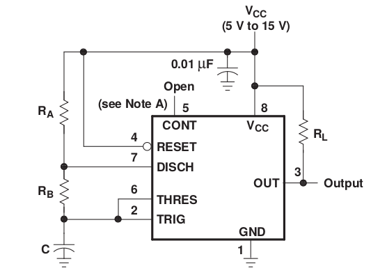

# 555

It's one of the most common IC available.

| PIN	| DESCRIPTION	| PURPOSE
|-----|-------------|---------
| 1	| Ground	| DC Ground
|2	 | Trigger	| The trigger pin triggers the beginning of the timing sequence. When it goes LOW, it causes the output pin to go HIGH. The trigger is activated when the voltage falls below 1/3 of +V on pin 8.
| 3	| Output	| The output pin is used to drive external circuitry. It has a "totem pole" configuration, which means that it can source or sink current. The HIGH output is usually about 1.7 volts lower than +V when sourcing current. The output pin can sink up to 200mA of current. The output pin is driven HIGH when the trigger pin is taken LOW. The output pin is driven LOW when the threshold pin is taken HIGH, or the reset pin is taken LOW.
| 4	| Reset	| The reset pin is used to drive the output LOW, regardless of the state of the circuit. When not used, the reset pin should be tied to +V.
| 5	| Control Voltage	| The threshold and trigger levels are controlled using this pin. The pulse width of the output waveform  is determined by connecting a POT or bringing in an external voltage to this pin.  The external voltage applied to this pin can also be used to modulate the output waveform. Thus, the amount of voltage applied in this terminal will decide when the comparator is to be switched, and thus changes the pulse width of the output. When this pin is not used, it should be bypassed to ground through a 0.01 micro Farad to avoid any noise problem.
| 6	| Threshold	| The threshold pin causes the output to be driven LOW when its voltage rises above 2/3 of +V.
| 7	| Discharge	| The discharge pin shorts to ground when the output pin goes HIGH. This is normally used to discharge the timing capacitor during oscillation.
| 8	| +V	| DC Power - Apply +3 to +18VDC here.

### Monostable

### Astable

The time intervals are given by the following equations:

$$
\begin{aligned}
t_1 &= 0.693(R_1 + R_2)\cdot C\cr
t_2 &= 0.693\cdot R_2\cdot C\cr
t_1 + t_2 &= 0.693 (R_1 + 2R_2)C
\end{aligned}
$$

Following this equations, in order to have a frequency of the order of a second
you need the orders of magnitude between resistors and capacitor to cancel out,
like $10\mu F$ and $100 k\Omega$.

 - http://www.electronics-tutorials.ws/waveforms/555_timer.html
 - http://www.sparkfun.com/products/9273
 - http://tronixstuff.wordpress.com/2011/01/27/the-555-precision-timer-ic/
 - http://lateblt.tripod.com/proj2.htm
 - http://www.robotroom.com/Infrared555.html
 - [PWM](http://www.dprg.org/tutorials/2005-11a/index.html) with 555

