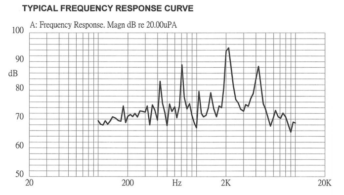

 - [Circuit theory Wikibooks](https://en.wikibooks.org/wiki/Circuit_Theory)
 - [EE Courses](http://cc.ee.ntu.edu.tw/~lhlu/eecourses.html)
 - [The Laplace Transform in Circuit Analysis](http://www.ee.nthu.edu.tw/~sdyang/Courses/Circuits/Ch13_Std.pdf)


## BASIC

The building blocks of every circuit are **current** and **voltage**: the first
measures the number of electrons passing a section of conductor in unit of time,
the unit of measure is the **Ampere** and it's indicated with $I$;
the voltage is the difference of potential between two pieces of conductor
and should generate a flow of current; its unit of measure is the **Volt**
indicated with $V$.

The power consumption of a circuit is given by

$$P=V\cdot I$$.


 - http://www.allaboutcircuits.com/
 - Site with pinout, tools etc: http://www.pighixxx.com/
 - http://www.slideshare.net/balgan/hardware-hacking-101
 - https://circuithub.com/
 - http://blog.thelifeofkenneth.com/2013/02/diy-usb-power-strip.html
 - http://www.ladyada.net/make/mintyboost/process.html
 - http://123d.circuits.io/
 - [How do I read a datasheet?](http://www.youtube.com/watch?v=DZIFlV6wAZA)
 - [H Bridge Motor Speed Controller Tutorial](https://www.youtube.com/watch?v=iYafyPZ15g8)
 - [Why 3.3v](http://www.societyofrobots.com/robotforum/index.php?topic=15573.0)


## Cable&Wire

### AWG

This is the standard wire gauge system, increasing gauge numbers denote decreasing wire
diameters; here the [table](https://it.wikipedia.org/wiki/American_wire_gauge#Tabella_delle_dimensioni_dei_fili_AWG)
from wikipedia.

 - [Wire Gauges](http://datagenetics.com/blog/september12016/index.html) The
   origin for the specification of the 'Gauge' of a wire is the number of dies
   that it has been pulled through - the higher the gauge, the more times it has
   been drawn.

### Crimping

 - [Video](https://www.youtube.com/watch?v=wEPdB-W3-Tc) where is shown how to crimp manually a female header

### Magnetic (enameled) wire

It's the kind of wire used also for inductor coils.

 - [Wikipedia entry](https://en.wikipedia.org/wiki/Magnet_wire)
 - [Video](https://www.youtube.com/watch?v=Mjjryf2aqaY) about soldering with it

## Tape

### Kapton

 - [Kapton masking](https://ultrakeet.com.au/write-ups/kaptonMasking)

## Resistors

It's the basic component of electronics and it's indicated by the $R$ letter.

$$I = {V\over R}$$

The unit is the **Ohm** and thanks to the previous formula we can link Ampere and
Volt by the following relation

$$[\Omega][I] = [V]$$

A particular type of resistence are the [polyfuse](http://www.littelfuse.com/~/media/electronics_technical/application_notes/resettable_ptcs/littelfuse_polyfuse_ptc_selection_guide_application_note.pdf)
that changes its value based on the current traversing it (first usage is overcurrent protection).

 - [Resistor Sizes and Packages](http://www.resistorguide.com/resistor-sizes-and-packages/)
 - How to solder SMT 0805 resistors capacitors: [video](https://www.youtube.com/watch?v=PU7wLcuqc-I)
 - Hand soldering 0603 components [video](https://www.youtube.com/watch?v=fqHleZjTaH8)

### Pull Up

 - [Pull-up Resistors](https://learn.sparkfun.com/tutorials/pull-up-resistors)
 - http://www.resistorguide.com/pull-up-resistor_pull-down-resistor/

### Voltage divider

$$V_{out} = V_{in}\cdot\left(R_2\over R_1 + R_2\right)$$

$$P = {V^2_{in}\over R_1 + R_2}$$

Be aware that [this solution it's not ideal](https://en.wikipedia.org/wiki/Electrical_load), you should use an ``NPN``
transistor in configuration **emitter follower**.

 - [Video](https://www.youtube.com/watch?v=XxLKfAZrhbM) from Afrotechmods

## Capacitors

This is another kind of component that is *ancient*: tipically consists of two plane
near each other that ``accumulate`` electric charge.

The main formula is

$$
I = C\cdot {dV\over dt}
$$

The unit of **capacitance** is called **Farad** and has the following relation with the other units

$$[F] = {[I][T]\over [V]}$$

There are different kind of capacitors, **ceramic** and **electrolytic**, each with pros and cons.

For example [ceramic capacitors depends on voltage](https://www.youtube.com/watch?v=2MQyQUkwmMk), but
[Electrolytics are 'bulk' capacitors, used for high values to hold up DC buses. Their parasistics make them unsuitable for filtering high frequencies](https://www.reddit.com/r/AskElectronics/comments/34eccb/when_do_you_use_electrolytic_versus_ceramic/cqu80j9).

### Codes

The codes below are generally found on ceramic (little round discs) and mylar (chicklet) capacitors,
which are not polarized, that is, there are no positive and negative leads ([source](http://beamdream.solarbotics.net/Tutorials/CapGuide.htm)).

| Values | Code |
|--------|------|
| 100pF  | 101  |
| 120pF  | 121  |
| 130pF  | 131  |
| 150pF  | 151  |
| 180pF  | 181  |
| 0.1uF  | 104  |
| 0.33uF | 334  |

The general code is ``XXY``, where

 - ``XX`` is the coefficient
 - ``Y``  is the esponent indicator $10^{-(11 - x)}$

### Decoupling

A standard practice for electronic circuits is to add decoupling capacitors to reduce
spikes and noise from power supplies and logic lines.

They have two main aims:

 - charge supply
 - filtering

The values of the capacitors depend on the frequencies of the AC components. Each capacitor
has its own frequency response determined by its resistance and Equivalent Series Inductance (ESL)
that is tuned to a range of frequencies. For example, to filter low frequencies you need a
larger capacitor. As a rule, a capacitor of 0.1-1µF suffices for the mid-range frequencies,
if you have slow fluctuations, you may choose around 1-10µF and for high-frequency noise you can
use 0.001-0.1µF capacitors. You can also use any combination of bypass capacitors to remove a wider
range of frequencies. For chips that drive a lot of current, you may put 10 µF - 100 µF capacitors
to work as buffers. If the value of the capacitor allows, use monolithic ceramic capacitors because
they are small and cheap.


 - [Capacitor decoupling](http://www.vagrearg.org/content/decoupling): The act of (partially) separating the logic chip's power supply from the main power supply. In this [video](https://www.youtube.com/watch?v=jz1IHapsrdk) more explanation
 - Choosing and Using Bypass Capacitors ([PDF](https://www.intersil.com/content/dam/Intersil/documents/an13/an1325.pdf))
 - [Video](https://www.youtube.com/watch?v=VfCu-siq0-Y): Decoupling capacitors and the 555 timer IC
 - [Video](https://www.youtube.com/watch?v=jz1IHapsrdk) (and another [video](https://www.youtube.com/watch?v=M2tJpEMIkWM)) with pretty good explanations of principle of decoupling.
 - http://www.thebox.myzen.co.uk/Tutorial/De-coupling.html
 - http://sites.fas.harvard.edu/~phys123/analog_notes/noise_note_sept09.pdf

## Inductors

They are like capacitors, but for magnetic fields.

The unit of measure is the **Henry** composed by

$$
H = {[V][T]\over [I]} = [R][T]
$$

 - [Magnetic core](https://en.wikipedia.org/wiki/Magnetic_core#AL_value)
 - http://computer.howstuffworks.com/question352.htm

A radio-frequency choke (RFC) is used in the collector circuit to provide a high reactance (ideally open circuit)
at the frequency of oscillation, ( ƒr ) and a low resistance at DC to help start the oscillations.

 - https://e2e.ti.com/blogs_/b/analogwire/archive/2014/04/23/when-to-use-an-rf-choke-vs-an-inductor

## Impedance

Electrical impedance is the measure of the opposition that a circuit presents to a current when a voltage is applied.

For a DC circuit it coincides with the resistance, for an AC circuit is a complex number that takes into account
the inductance and capacitance effects.

The analytical form for each type of components is the following:
$$
Z_R = R\quad Z_C = j{1\over \omega C}\quad Z_L = j\omega L
$$

## Switch

There are several codes related to this passive element (see [wikipedia](https://en.wikipedia.org/wiki/Switch#Contact_terminology))

 - N.O: normally open
 - N.C: normally closed
 - SPST: Single pole, single throw
 - SPDT: Single pole, double throw

 - [Contatti digitali](https://checco76.wordpress.com/2010/11/09/contatti-digitali-no-nc-spst-spdt-brief-tutorial/)

## Buzzer

They are sound devices, activated by electromagnetic effects; [they have some frequencies that
are more loud than other](http://www.instructables.com/id/How-to-make-an-Arduino-driven-Piezo-LOUD/), you have to see their **response curve** like this one



A code sample in an Arduino is

```C
#define ALARM 8
#define SOUND_PARAMETER 300

void sound() {
  for (int i = 0 ; i < SOUND_PARAMETER; i++) {
    analogWrite(ALARM, 255);
    delayMicroseconds(200);
  
    analogWrite(ALARM, 0);
    delayMicroseconds(200);
  }

  delay(SOUND_PARAMETER);
}
```

## Rotatory encoder

 - http://www.hobbytronics.co.uk/tutorials-code/arduino-tutorials/arduino-tutorial6-rotary-encoder

HACK
----

 - https://sites.google.com/site/seagatefix/
 - https://trmm.net/SPI
 - https://trmm.net/Thunderstrike_31c3
 - [The Layman's Guide to IC Reverse Engineering](http://siliconzoo.org/tutorial.html)
 - [HEADPHONE JACK COMMUNICATIONS](http://www.espruino.com/Headphone)


CMOY
----

 - http://tangentsoft.net/audio/cmoy-tutorial/

LCD
---

 - http://jormungand.net/projects/devices/avrlcd/

VARIOUS
-------
 - http://provideyourown.com/2011/analogwrite-convert-pwm-to-voltage/
 - http://www.ifixit.com
 - http://bildr.org/2012/03/rfp30n06le-arduino/
 - http://www.instructables.com/id/Attiny254585-PWM-generator-and-Servo-tester/
 - [Hardware Random Number Generator](http://iank.org/trng.html)
 - [Copy Protection in Modern Microcontrollers](http://www.cl.cam.ac.uk/~sps32/mcu_lock.html)

STORE&BLOGS
-----------

 - [Radioshack](http://www.radioshack.com)
 - [Digikey](http://www.digikey.com)
 - [Sparkfun](http://www.sparkfun.com)
 - [Littlebirdelectronics](http://littlebirdelectronics.com)
 - [Seeed studio](http://www.seeedstudio.com)
 - http://shop.moderndevice.com/
 - http://www.beavisaudio.com/techpages/
 - http://bildr.org/
 - [RS online](http://it.rs-online.com)
 - [aliexpress](http://aliexpress.com)
 - [Deal extreme](http://www.dx.com/)
