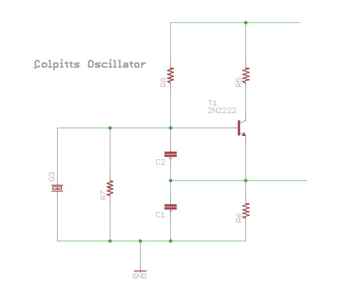

# Oscillator

Sometimes we need a timed signal to use as a clock (but also
for other things).

## General theory

The [Barkhausen stability criterion](https://en.wikipedia.org/wiki/Barkhausen_stability_criterion)
says that

 1. the loop gain exceeds unity at the resonant frequency
 2. the fase shift around the loop is $2\pi n$ (where $n\in N$)

bad enough seems that [the  Barkhausen Stability Criterion is simple, intuitive, and wrong](http://web.mit.edu/klund/www/weblatex/node4.html).

## RC&Phase Shift Oscillator

 - [Tutorial](http://www.electronics-tutorials.ws/oscillator/rc_oscillator.html)
 - [PDF](http://www.inictel-uni.edu.pe/sites/default/files/archivos/2014/publicaciones/12/rc_phase_shift_oscillators.pdf) with derivation of equation

## Crystal

Quartz is a piezoelectric material. When an electric
field is placed upon it, a physical displacement occurs.
Interestingly enough, we can write an equivalent electrical
circuit to represent the mechanical properties of
the crystal.

## Colpitts oscillator

 - [slide](https://www.seas.upenn.edu/~ese319/Lecture_Notes/Lec_19_Colpitts_Osc_09.pdf) with derivation formulas for the colpitts oscillator
 - [Video](https://www.youtube.com/watch?v=I4bAfDu6F1k) Colpitts Crystal Oscillator Fundamentals
 - http://www.electronics-tutorials.ws/oscillator/colpitts.html
 - http://www.electronics-tutorials.ws/oscillator/crystal.html
 - https://makerf.com/posts/experimenting_with_colpitts_oscillators

## Negative resistance oscillator

Some active devices (like diode and transistor) have *zone* of **negative resistance** that can
be used to amplify the feedback loop of an oscillating circuit.

 - [Video](https://www.youtube.com/watch?v=rpGOKGrcpAk) World's Simplest Single Transistor Oscillator - BJT with Negative Resistance
 - [Page](https://www.st-andrews.ac.uk/~www_pa/Scots_Guide/RadCom/part5/page1.html) with a more elaborated explanation of NR.

## Voltage controlled oscillator (VCO)

 - https://www.electronicshub.org/voltage-controlled-oscillators-vco/
 - https://electronics.stackexchange.com/questions/233607/sawtooth-vco-and-current-source-for-modular-synthesizer
 - Posts ([1](http://xonik.no/theory/vco/expo_converter_1.html) [2](http://xonik.no/theory/vco/expo_converter_2.html) e [3](http://xonik.no/theory/vco/reference_current.html)) about
   building a VCO creating a current source
 - https://electronics.stackexchange.com/questions/207668/how-do-i-make-a-vco-with-a-lm-358
 - https://www.allaboutcircuits.com/projects/diy-synth-series-vco/

### Links

 - Crystal Oscillator Basics and Crystal Selection for rfPICTM and PICmicro® Devices ([PDF](http://ww1.microchip.com/downloads/en/appnotes/00826a.pdf))
 - Crystal Oscillator Circuit Design ([PDF](http://www.eetkorea.com/ARTICLES/2001SEP/2001SEP06_AMD_AN.PDF))
 - Sparkfun [tutorial](https://www.sparkfun.com/tutorials/95)
 - Choosing the Right Crystal and Caps for your Design ([post](https://blog.adafruit.com/2012/01/24/choosing-the-right-crystal-and-caps-for-your-design/)
 - Microcontroller Oscillator Circuit Design Considerations ((PDF)[http://www.freescale.com/files/microcontrollers/doc/app_note/AN1706.pdf])
 - [Tutorial](http://www.electronics-tutorials.ws/oscillator/crystal.html) about crystals with pratical example of circuit using them.
 - [Video](https://www.youtube.com/watch?v=eYVOdlK15Og) with simple example of oscillators (with a little bit of oscilloscope)
 - [Slides](http://cc.ee.ntu.edu.tw/~lhlu/eecourses/Electronics3/Electronics_Ch14.pdf) SIGNAL GENERATORS AND WAVEFORM-SHAPING CIRCUITS
- [Crystal tester circuit](http://www.electroschematics.com/942/crystal-tester/)
