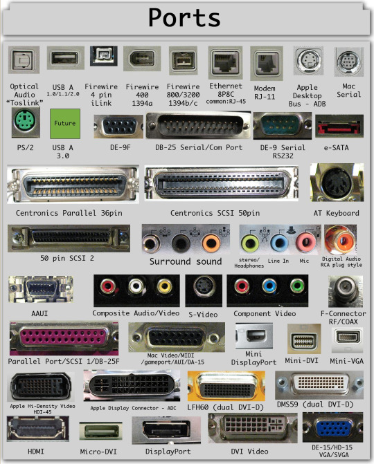

# Protocols

Electronics is about voltage and stuffs but as humans we use it for
connect devices and devices connected need ways to communicate.

## PWM

The acronym means **Pulse Width Modulation** and it's the simplest
way to digitally encode a signal using a single wire; it's defined
by the **duty cycle**, i.e. the percentage of the cycle that the
signal is on (0% is always off, 100% is always on) and its **switching frequency**,
that identify how many seconds each raising edge appears.

Its fourier transformed form is given by this coefficients ($p$ is the duty cycle
$0\leq p\leq 1$)

$$
A_0 = K\cdot p
$$
$$
A_n = K\cdot {1\over n\pi}\left(\sin(n\pi p) - \sin\left(2n\pi (1 - p/2)\right)\right)
$$

## UART and Serial

The simplest of protocols without needing a clock line, usually it's exposed
as a 4 pins header but it's also possible to be exposed via already used IO
port (like [headphone socket](http://www.pabr.org/consolejack/consolejack.en.html) or
USB port via [USB port multimedia switch](https://www.fairchildsemi.com/datasheets/FS/FSA9280A.pdf)).

 - http://wiki.openwrt.org/doc/hardware/port.serial
 - http://www.devttys0.com/2012/11/reverse-engineering-serial-ports/

## I2C

It uses only two wires, and allows to connect up to 1008 slave devices.

## SPI

It's a protocol with a clock line and a differentiation between devices that can be
**master** (that provides clock) or **slave**. Although may there be only one master
there is a signal (**SS**) that indicates which one of the (possible) multiple slaves
must respond.

It has the disadvantage that the communication must be well defined in advance since the
master must know how many clock cycle need to listen from the slaves.

### SD Card

For example an SD Card use this protocol (see a link in the Bus Pirate page) how you can
read [here](http://elm-chan.org/docs/mmc/mmc_e.html) and [here](http://www.dejazzer.com/ee379/lecture_notes/lec12_sd_card.pdf).

The pin ``CD`` stand for **card detection**: when is low the card is inserted into its socket.

### Links

 - https://learn.sparkfun.com/tutorials/serial-peripheral-interface-spi
 - [Reference](https://www.sdcard.org/downloads/pls/part1_410.pdf) for SD card protocol

## PS/2

 - [Protocol description](http://www.computer-engineering.org/ps2protocol/)

## JTAG

It's a protocol used to _debug hardware_ and uses the following pins that constitute the **TAP**,
the Test Access Port:

 - **TMS:** Test Mode Select. This pin is used to cycle through the TAP-state machine.
 - **TCK:** Test Clock.
 - **TDI:** Test Data In. Serial input data to be shifted in to the Instruction Register or Data Register.
 - **TDO:** Test Data Out.  Serial output data from Instruction Register or Data Register.

Usually on reference is indicated also the **VTRef** pin that indicates what is the voltage reference
for the 

 - [JTAG explained](http://blog.senr.io/blog/jtag-explained)
 - [How JTAG works](http://www.fpga4fun.com/JTAG2.html)
 - https://hackingbtbusinesshub.wordpress.com/2012/01/26/discovering-jtag-pinouts/
 - http://sun.hasenbraten.de/~frank/docs/mpc824x_JTAG.html
 - Header per SOC da [farnell](http://uk.farnell.com/fci/20021121-00010c4lf/connector-header-smt-r-a-1-27mm/dp/1865279?ost=609-3695-1-ND)
 - [Slide](http://elinux.org/images/d/d6/Jtag.pdf) of a talk about finding JTAG's pinout
 - [JTAGEnum](https://github.com/cyphunk/JTAGenum/] Given an Arduino compatible microcontroller JTAGenum scans pins for basic JTAG functionality.
 - http://www.sodnpoo.com/posts.xml/pace4000_jtag.xml
 - https://www.youtube.com/watch?v=TlWlLeC5BUs
 - http://electronics.stackexchange.com/questions/53311/why-jtag-connectors-are-available-in-10pins-14pins-20pins-when-jtag-is-of-5pins
 - https://github.com/syncsrc/jtagsploitation
 - [Video](https://www.youtube.com/watch?v=Up0697E5DGc) Blackbox JTAG Reverse Engineering [26C3]
 - [Preparing Raspberry PI for JTAG Debugging](http://sysprogs.com/VisualKernel/tutorials/raspberry/jtagsetup/)
 - [Black Magic Probe V2](http://1bitsquared.de/products/black-magic-probe) is a JTAG and SWD Adapter used for programming and debugging ARM Cortex MCUs.

## USB

This is a well known protocol, used everywhere in electronics devices, the acronym means **Universal Serial Bus**.

This protocol can work at three defined speeds

|Name | Speed |
|-----|-----------|
|Low  | 1.5Mbit/s |
|Full | 12Mbit/s  |
|High | 480Mbit/s |

The architecture of this protocol is *tiered star topology*, there can be no communication directly between USB devices.

 - [USB Central](http://janaxelson.com/usb.htm)
 - http://www.usbmadesimple.co.uk/ums_2.htm

## VGA

 - [VGA On The Arduino With No External Parts Or CPU!](http://dpeckett.com/vga-on-the-arduino-with-no-external-parts)
 - [VGA (Video Graphics Array) Interface and video signal documents](http://martin.hinner.info/vga/)
 - [VGA Controller (VHDL)](https://eewiki.net/pages/viewpage.action?pageId=15925278)
 - [CS/EE 3710 - Computer Design Lab - Lab 3 – VGA](http://www.eng.utah.edu/~cs3710/labs/VGA.pdf)
 - [VGA Text-mode](http://www.flingos.co.uk/docs/reference/VGA-Text-Mode/)
 - [Hardware Level VGA and SVGA Video Programming Information Page](http://www.osdever.net/FreeVGA/vga/vgatext.htm)
