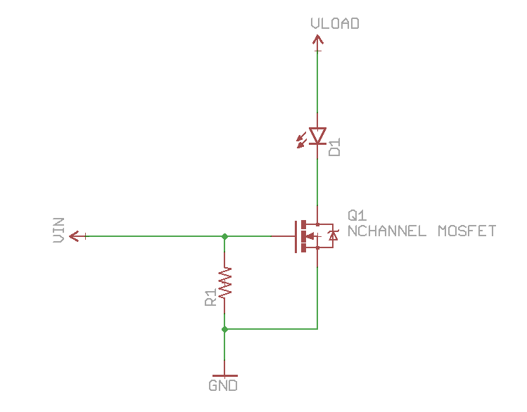

# Transistors

Have three pins named **gate**, **source** and **drain**

MOSFET is voltage controlled. While BJT is current controlled,

## BJT

The common emitter amplifier configuration produces the highest current and power gain
of all the three bipolar transistor configurations. This is mainly because the input
impedance is LOW as it is connected to a forward biased PN-junction, while the output
impedance is HIGH as it is taken from a reverse biased PN-junction.

 - [Bipolar Transistor](http://www.electronics-tutorials.ws/transistor/tran_1.html)
 - [Tutorial](http://blog.oscarliang.net/bjt-bipolar-junction-transistor-beginner-tutorial/)

## MOSFET

Variable resistor controlled by voltage: you can vary the resistence between drain and source
varing the voltage applied between gate and source. The output current is not a multiplier
of the input current (remind that MOSFET are all about voltage).

 - $R_{DS}(on)$
  - $V_{GS}TH$: Voltage threasold between gate and source (if it's less than 5 volts then is logic level)

It's important to calculate the power (and of conseguence the heat) consumed by the formula

$$
P = R_{DS}\cdot I^2
$$

and with the parameter $R_{\theta JA}$ (Junction to ambient coefficient) and the following
formula that calculate the power dissipated at ambient temperature $T_A$ when the
transistor has a maximum junction temperature $T_J$

$$
P_D = {\max(T_J) - T_A\over R_{\theta JA}}
$$

If $P\leq P_D$ then you don't need a dissipator.

Here an example of usage

## Links

 - [EE 320/320L Electronics I](http://whites.sdsmt.edu/classes/ee320/)
 - [Tutorial by Sparkfun](https://learn.sparkfun.com/tutorials/transistors)
 - http://electronics.stackexchange.com/questions/19233/when-to-use-what-transistor
 - http://blog.oscarliang.net/how-to-use-mosfet-beginner-tutorial/
 - [AO #10 BJTs as Transistor Switches](https://www.youtube.com/watch?v=sRVvUkK0U80)
 - [AO #11 MOSFETs and How to Use Them](https://www.youtube.com/watch?v=GrvvkYTW_0k)
 - [Transistor biasing](http://www.electronics-tutorials.ws/amplifier/transistor-biasing.html)
 - https://rheingoldheavy.com/building-things-npn-transistors/
